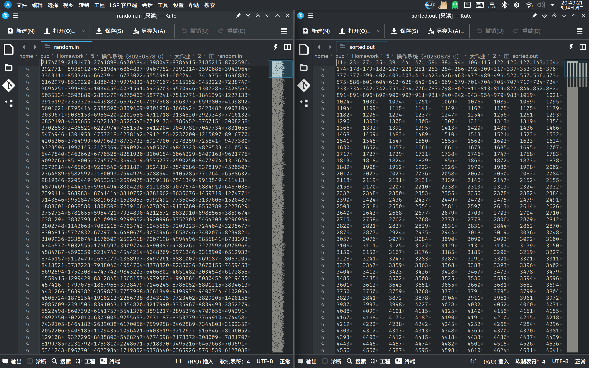

# 实验2：高级进程间通信问题——快速排序问题

## 问题描述

对于有 1,000,000 个乱序数据的数据文件执行快速排序。

## 实验步骤

（1）首先产生包含 1,000,000 个随机数（数据类型可选整型或者浮点型）的数据文件；

（2）每次数据分割后产生两个新的进程（或线程）处理分割后的数据，每个进程（线程）处理的数据小于 1000 以后不再分割（控制产生的进程在 20 个左右）；

（3）线程（或进程）之间的通信可以选择下述机制之一进行：

- 管道（无名管道或命名管道）
- 消息队列
- 共享内存

（4）通过适当的函数调用创建上述IPC对象，通过调用适当的函数调用实现数据的读出与写入；

（5）需要考虑线程（或进程）间的同步；

（6）线程（或进程）运行结束，通过适当的系统调用结束线程（或进程）。

## 设计思路

编程语言：C++

编程平台：Linux

对于快速排序问题，共享内存是最好的选择，因为共享内存更加适用于像本题这样需要大规模数据共享的场景。快速排序作为分治法的典型代表，分治后的数据间互不干扰，因此较为适合使用共享内存，而不需要考虑线程间的同步问题。在这种条件下，使用多线程是比较自然的选择，因为线程间共享地址空间，可以直接访问共享内存。

本题还需要控制产生的线程在 20 个左右，因此需要在递归过程中控制线程的生成。在每次数据分割后，如果线程数超过 20 个，则不再生成新的线程，而是直接处理数据。

### 生成随机数

首先生成 1,000,000 个随机数，随机数范围为 0 到 10,000,000，将随机数写入文件 `random.in`。

```cpp
/// @brief 生成随机数
/// @param n 随机数数量
/// @param min 随机数最小值
/// @param max 随机数最大值
/// @return `std::vector<int>` 随机数数组
std::vector<int> generateRandomNumbers(int n, int min, int max)
{
    std::random_device rd;       // 随机数种子
    std::vector<int> numbers(n); // 随机数数组
    std::generate(numbers.begin(), numbers.end(), [&]
                  { return rd() % (max - min + 1) + min; }); // 生成随机数
    return numbers;
}
```

### 快速排序

快速排序需要实现一个递归函数，对数组进行分割。在分割的过程中，判断数组长度是否小于 1000，若小于 1000，则直接进行排序。在分割的过程中，判断线程数量是否小于 20，若小于 20，则生成新的线程处理分割后的数据。

```cpp
/// @brief 快速排序
/// @param arr 待排序数组
/// @param left 左边界
/// @param right 右边界
void quicksort(std::vector<int> &arr, int left, int right)
{
    if (left < right) // 递归终止条件
    {
        if (right - left < THRESHOLD) // 若数组长度小于 1000，直接排序
        {
            std::sort(arr.begin() + left, arr.begin() + right + 1);
            return;
        }

        int pivot = arr[left + (right - left) / 2]; // 选取中间元素作为 pivot
        int i = left, j = right;
        while (i <= j) // 分割数组
        {
            while (arr[i] < pivot)
                i++;
            while (arr[j] > pivot)
                j--;
            if (i <= j)
            {
                std::swap(arr[i], arr[j]);
                i++;
                j--;
            }
        }

        std::thread left_thread, right_thread;        // 左右子线程
        bool spawn_left = false, spawn_right = false; // 是否生成子线程

        {
            std::lock_guard<std::mutex> lock(mtx);                // 加锁
            spawn_left = (left < j) && (threads < MAX_THREADS);   // 判断是否生成左子线程
            spawn_right = (i < right) && (threads < MAX_THREADS); // 判断是否生成右子线程
        }

        if (spawn_left)
        {
            threads++;                                                    // 线程数量加一
            std::cout << "threads: " << threads << std::endl;             // 输出线程数量
            left_thread = std::thread(quicksort, std::ref(arr), left, j); // 生成左子线程
        }
        else if (left < j)
        {
            quicksort(arr, left, j);
        }

        if (spawn_right)
        {
            threads++;                                                      // 线程数量加一
            std::cout << "threads: " << threads << std::endl;               // 输出线程数量
            right_thread = std::thread(quicksort, std::ref(arr), i, right); // 生成右子线程
        }
        else if (i < right)
        {
            quicksort(arr, i, right);
        }

        if (left_thread.joinable()) // 等待左子线程结束
        {
            left_thread.join();
            {
                std::lock_guard<std::mutex> lock(mtx); // 加锁
                threads--;                             // 线程数量减一
            }
        }
        if (right_thread.joinable()) // 等待右子线程结束
        {
            right_thread.join();
            {
                std::lock_guard<std::mutex> lock(mtx); // 加锁
                threads--;                             // 线程数量减一
            }
        }
    }
}
```

### 主函数

主函数需要生成随机数，将随机数写入文件，调用快速排序函数，将排序后的数据写入文件，检查排序是否正确等。

```cpp
int main()
{
    std::fstream randomFile(RANDOM_FILENAME, std::ios::out);
    std::fstream sortedFile(SORTED_FILENAME, std::ios::out);

    // 生成随机数
    std::vector<int> data = generateRandomNumbers(RANDOM, RANDOM_MIN, RANDOM_MAX);
    std::cout << "Random numbers generated" << std::endl;

    // 将随机数写入文件
    for (auto i : data)
    {
        randomFile << i << "\t";
    }
    std::cout << "Random numbers written to file" << std::endl;

    // 排序
    quicksort(data, 0, data.size() - 1);
    std::cout << "Numbers sorted" << std::endl;

    // 将排序后的数字写入文件
    for (auto i : data)
    {
        sortedFile << i << "\t";
    }
    std::cout << "Sorted numbers written to file" << std::endl;

    // 检查排序是否正确
    for (auto i = 1; i < data.size(); i++)
    {
        if (data[i] < data[i - 1])
        {
            std::cerr << "Sort failed" << std::endl;
            return 1;
        }
    }
    std::cout << "Sort succeeded" << std::endl;

    randomFile.close();
    sortedFile.close();
    return 0;
}
```

## 实验结果

运行程序，可以看到线程数量逐渐增加，最终达到 20 个，然后在 20 个左右上下波动，逐渐减少，最终结束。

```
Random numbers generated
Random numbers written to file
threads: 1
threads: 2
threads: 3
...
Numbers sorted
Sorted numbers written to file
Sort succeeded
./quicksort  31.03s user 0.05s system 100% cpu 31.065 total
```

程序创建了两个文件，`random.in` 和 `sorted.out`，分别存储了随机数和排序后的数据。可见排序成功。



## 思考题

1. 你采用了你选择的机制而不是另外的两种机制解决该问题，请解释你做出这种选择的理由。

    > 我选择了多线程共享内存的机制来解决控制线程数量的问题。首先，多线程共享内存是非常高效的，因为线程共享同一个地址空间，不需要进行跨进程的数据复制。任务队列可以有效地管理任务并控制并发数。另外，使用 C++ 标准库中的 `std::thread`、`std::mutex` 非常方便。这些工具提供了强大的功能，可以简化并发编程的复杂性。

2. 你认为另外的两种机制是否同样可以解决该问题？如果可以请给出你的思路；如果不能，请解释理由。

    > - 管道理论上可以解决该问题，但是不适合。思路如下：
    >   - 父进程创建一对管道，用于传递排序任务。
    >   - 父进程监控管道中的任务数量，并控制子进程的创建和退出。
    >   - 子进程从管道中读取任务，完成排序后将结果写回父进程。
    >   - 父进程等待所有子进程完成后，合并结果。
    > - 消息队列理论上可以解决该问题，但复杂性较高。思路如下：
    >   - 主线程管理一个消息队列，用于分发和接收排序任务。
    >   - 主线程监控消息队列中的任务数量，并控制工作线程的创建和退出。
    >   - 工作线程从消息队列中读取任务，完成排序后将结果写回消息队列。
    >   - 主线程等待所有工作线程完成后，合并结果。

## 源代码

```cpp
#include <iostream>
#include <fstream>

#include <algorithm>
#include <mutex>
#include <random>
#include <thread>
#include <vector>

const int RANDOM = 1000000;      // 随机数数量
const int RANDOM_MIN = 0;        // 随机数最小值
const int RANDOM_MAX = 10000000; // 随机数最大值
const int THRESHOLD = 1000;      // 最小分割阈值
const int MAX_THREADS = 20;      // 最大线程数量

const char *RANDOM_FILENAME = "random.in";  // 随机数文件名
const char *SORTED_FILENAME = "sorted.out"; // 排序后文件名

int threads = 0; // 线程数量
std::mutex mtx;  // 互斥锁

/// @brief 生成随机数
/// @param n 随机数数量
/// @param min 随机数最小值
/// @param max 随机数最大值
/// @return `std::vector<int>` 随机数数组
std::vector<int> generateRandomNumbers(int n, int min, int max)
{
    std::random_device rd;       // 随机数种子
    std::vector<int> numbers(n); // 随机数数组
    std::generate(numbers.begin(), numbers.end(), [&]
                  { return rd() % (max - min + 1) + min; }); // 生成随机数
    return numbers;
}

/// @brief 快速排序
/// @param arr 待排序数组
/// @param left 左边界
/// @param right 右边界
void quicksort(std::vector<int> &arr, int left, int right)
{
    if (left < right) // 递归终止条件
    {
        if (right - left < THRESHOLD) // 若数组长度小于 1000，直接排序
        {
            std::sort(arr.begin() + left, arr.begin() + right + 1);
            return;
        }

        int pivot = arr[left + (right - left) / 2]; // 选取中间元素作为 pivot
        int i = left, j = right;
        while (i <= j) // 分割数组
        {
            while (arr[i] < pivot)
                i++;
            while (arr[j] > pivot)
                j--;
            if (i <= j)
            {
                std::swap(arr[i], arr[j]);
                i++;
                j--;
            }
        }

        std::thread left_thread, right_thread;        // 左右子线程
        bool spawn_left = false, spawn_right = false; // 是否生成子线程

        {
            std::lock_guard<std::mutex> lock(mtx);                // 加锁
            spawn_left = (left < j) && (threads < MAX_THREADS);   // 判断是否生成左子线程
            spawn_right = (i < right) && (threads < MAX_THREADS); // 判断是否生成右子线程
        }

        if (spawn_left)
        {
            threads++;                                                    // 线程数量加一
            std::cout << "threads: " << threads << std::endl;             // 输出线程数量
            left_thread = std::thread(quicksort, std::ref(arr), left, j); // 生成左子线程
        }
        else if (left < j)
        {
            quicksort(arr, left, j);
        }

        if (spawn_right)
        {
            threads++;                                                      // 线程数量加一
            std::cout << "threads: " << threads << std::endl;               // 输出线程数量
            right_thread = std::thread(quicksort, std::ref(arr), i, right); // 生成右子线程
        }
        else if (i < right)
        {
            quicksort(arr, i, right);
        }

        if (left_thread.joinable()) // 等待左子线程结束
        {
            left_thread.join();
            {
                std::lock_guard<std::mutex> lock(mtx); // 加锁
                threads--;                             // 线程数量减一
            }
        }
        if (right_thread.joinable()) // 等待右子线程结束
        {
            right_thread.join();
            {
                std::lock_guard<std::mutex> lock(mtx); // 加锁
                threads--;                             // 线程数量减一
            }
        }
    }
}

int main()
{
    std::fstream randomFile(RANDOM_FILENAME, std::ios::out);
    std::fstream sortedFile(SORTED_FILENAME, std::ios::out);

    // 生成随机数
    std::vector<int> data = generateRandomNumbers(RANDOM, RANDOM_MIN, RANDOM_MAX);
    std::cout << "Random numbers generated" << std::endl;

    // 将随机数写入文件
    for (auto i : data)
    {
        randomFile << i << "\t";
    }
    std::cout << "Random numbers written to file" << std::endl;

    // 排序
    quicksort(data, 0, data.size() - 1);
    std::cout << "Numbers sorted" << std::endl;

    // 将排序后的数字写入文件
    for (auto i : data)
    {
        sortedFile << i << "\t";
    }
    std::cout << "Sorted numbers written to file" << std::endl;

    // 检查排序是否正确
    for (auto i = 1; i < data.size(); i++)
    {
        if (data[i] < data[i - 1])
        {
            std::cerr << "Sort failed" << std::endl;
            return 1;
        }
    }
    std::cout << "Sort succeeded" << std::endl;

    randomFile.close();
    sortedFile.close();
    return 0;
}
```
