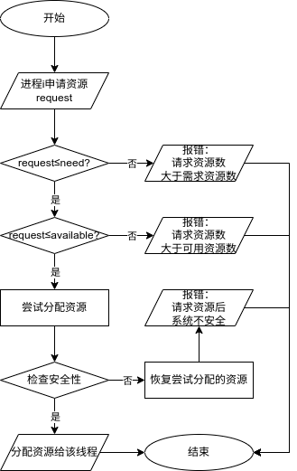

# 实验4：处理机调度——银行家算法

## 问题描述

银行家算法是避免死锁的一种重要方法，将操作系统视为银行家，操作系统管理的资源视为银行家管理的资金，进程向操作系统请求分配资源即企业向银行申请贷款的过程。

请根据银行家算法的思想，编写程序模拟实现动态资源分配，并能够有效避免死锁的发生。

## 设计思路

编程语言：C++

编程平台：Linux

使用流程图描述该银行家如下：



### 银行家算法实现

1. 初始化银行家类，包括进程数、资源数、可用资源向量、需求矩阵、已分配矩阵、最大需求矩阵。
2. 实现银行家算法的安全性检查函数 `isSafe()`，判断系统是否安全，返回安全序列。
3. 实现银行家算法的资源请求函数 `requestResources()`，判断请求资源是否合法，若合法则分配资源，否则返回错误信息。
4. 实现银行家类的打印函数 `print()`，打印当前系统状态。

#### 银行家算法安全性检查函数

首先，初始化工作向量、完成向量、安全序列，然后遍历所有进程，检查是否有满足条件的进程，若找到则将其加入安全序列，直到所有进程都完成。

```cpp
bool isSafe()
{
    std::vector<int> work = available;             // 工作向量
    std::vector<bool> finish(numProcesses, false); // 完成向量
    std::vector<int> safeSequence;                 // 安全序列
    int count = 0;
    while (count < numProcesses) // 直到所有进程都完成
    {
        bool found = false;                    // 是否找到一个满足条件的进程
        for (int i = 0; i < numProcesses; i++) // 遍历所有进程
        {
            std::cout << "正在对进程" << i << "进行安全性检查" << std::endl;
            if (!finish[i]) // 进程 i 未完成
            {
                std::cout << " -> 进程" << i << "未完成" << std::endl;
                int j;
                for (j = 0; j < numResources; j++) // 检查进程 i 的需求是否小于等于工作向量
                {
                    if (need[i][j] > work[j]) // 进程 i 的需求大于工作向量
                    {
                        std::cout << " -> 进程" << i << "的需求大于工作向量" << std::endl;
                        break;
                    }
                }
                if (j == numResources) // 进程 i 的需求小于等于工作向量
                {
                    std::cout << " -> 进程" << i << "的需求小于等于工作向量" << std::endl;
                    for (int k = 0; k < numResources; k++) // 将进程 i 已分配的资源释放到工作向量
                    {
                        work[k] += allocation[i][k];
                    }
                    finish[i] = true;          // 进程 i 完成
                    safeSequence.push_back(i); // 将进程 i 加入安全序列
                    count++;                   // 完成进程数加一
                    found = true;              // 找到一个满足条件的进程
                }
            }
        }
        if (!found) // 未找到一个满足条件的进程
        {
            std::cout << "系统不安全" << std::endl;
            return false;
        }
    }
    std::cout << "系统安全" << std::endl;
    std::cout << "安全序列为：";
    for (int i = 0; i < numProcesses; i++)
    {
        std::cout << safeSequence[i] << " ";
    }
    std::cout << std::endl;
    return true;
}
```

#### 银行家算法资源请求函数

首先，检查请求资源是否合法，若合法则模拟分配资源，判断系统是否安全，若系统不安全则回滚分配。

```cpp
bool requestResources(int process, std::vector<int> request)
{
    if (process < 0 || process >= numProcesses)
    {
        std::cout << "无效的进程编号" << std::endl;
        return false;
    }

    if (request.size() != numResources)
    {
        std::cout << "请求资源向量大小错误" << std::endl;
        return false;
    }

    for (int i = 0; i < numResources; i++)
    {
        if (request[i] > need[process][i]) // 请求资源数大于需求资源数，拒绝请求
        {
            std::cout << "请求资源数大于需求资源数" << std::endl;
            return false;
        }
        if (request[i] > available[i]) // 请求资源数大于可用资源数，拒绝请求
        {
            std::cout << "请求资源数大于可用资源数" << std::endl;
            return false;
        }
    }
    for (int i = 0; i < numResources; i++) // 模拟分配资源
    {
        available[i] -= request[i];
        allocation[process][i] += request[i];
        need[process][i] -= request[i];
    }
    if (!isSafe()) // 系统不安全，回滚分配
    {
        for (int i = 0; i < numResources; i++)
        {
            available[i] += request[i];
            allocation[process][i] -= request[i];
            need[process][i] += request[i];
        }
        std::cout << "请求资源后系统不安全" << std::endl;
        return false;
    }
    std::cout << "请求资源成功" << std::endl;
    return true;
}
```

## 测试样例

### 成功分配

$$
\text{Need} = \begin{bmatrix}
7 & 4 & 3 \\
1 & 2 & 2 \\
6 & 0 & 0 \\
0 & 1 & 1 \\
4 & 3 & 1
\end{bmatrix}, \text{Allocation} = \begin{bmatrix}
0 & 1 & 0 \\
2 & 0 & 0 \\
3 & 0 & 2 \\
2 & 1 & 1 \\
0 & 0 & 2
\end{bmatrix}, \text{Available} = \begin{bmatrix}
3 & 3 & 2
\end{bmatrix}
$$

进程 1 请求资源 $\begin{bmatrix} 1 & 0 & 2 \end{bmatrix}$。

该情况存在安全序列 1 3 4 0 2，系统安全。

输出如下：

```
====================================
初始化状态：
可用资源向量：3 3 2 
需求矩阵：
7 4 3 
1 2 2 
6 0 0 
0 1 1 
4 3 1 
已分配矩阵：
0 1 0 
2 0 0 
3 0 2 
2 1 1 
0 0 2 
====================================

进程1请求资源：1 0 2 
正在对进程0进行安全性检查
 -> 进程0未完成
 -> 进程0的需求大于工作向量
正在对进程1进行安全性检查
 -> 进程1未完成
 -> 进程1的需求小于等于工作向量
正在对进程2进行安全性检查
 -> 进程2未完成
 -> 进程2的需求大于工作向量
正在对进程3进行安全性检查
 -> 进程3未完成
 -> 进程3的需求小于等于工作向量
正在对进程4进行安全性检查
 -> 进程4未完成
 -> 进程4的需求小于等于工作向量
正在对进程0进行安全性检查
 -> 进程0未完成
 -> 进程0的需求小于等于工作向量
正在对进程1进行安全性检查
正在对进程2进行安全性检查
 -> 进程2未完成
 -> 进程2的需求小于等于工作向量
正在对进程3进行安全性检查
正在对进程4进行安全性检查
系统安全
安全序列为：1 3 4 0 2 
请求资源成功
====================================
最终状态：
可用资源向量：2 3 0 
需求矩阵：
7 4 3 
0 2 0 
6 0 0 
0 1 1 
4 3 1 
已分配矩阵：
0 1 0 
3 0 2 
3 0 2 
2 1 1 
0 0 2 
====================================
```

### 请求资源数大于可用资源数

$$
\text{Need} = \begin{bmatrix}
7 & 4 & 3 \\
1 & 2 & 2 \\
6 & 0 & 0 \\
0 & 1 & 1 \\
4 & 3 & 1
\end{bmatrix}, \text{Allocation} = \begin{bmatrix}
0 & 1 & 0 \\
2 & 0 & 0 \\
3 & 0 & 2 \\
2 & 1 & 1 \\
0 & 0 & 2
\end{bmatrix}, \text{Available} = \begin{bmatrix}
2 & 3 & 0
\end{bmatrix}
$$

进程 4 请求资源 $\begin{bmatrix} 3 & 3 & 0 \end{bmatrix}$。

请求资源数大于可用资源数，请求失败。

输出如下：

```
====================================
初始化状态：
可用资源向量：2 3 0 
需求矩阵：
7 4 3 
0 2 0 
6 0 0 
0 1 1 
4 3 1 
已分配矩阵：
0 1 0 
3 0 2 
3 0 2 
2 1 1 
0 0 2 
====================================

进程4请求资源：3 3 0 
请求资源数大于可用资源数
====================================
最终状态：
可用资源向量：2 3 0 
需求矩阵：
7 4 3 
0 2 0 
6 0 0 
0 1 1 
4 3 1 
已分配矩阵：
0 1 0 
3 0 2 
3 0 2 
2 1 1 
0 0 2 
====================================
```

### 死锁

$$
\text{Need} = \begin{bmatrix}
2 & 4 & 4 \\
0 & 1 & 0 \\
1 & 1 & 0 \\
1 & 1 & 6 \\
6 & 3 & 1
\end{bmatrix}, \text{Allocation} = \begin{bmatrix}
0 & 1 & 0 \\
3 & 0 & 0 \\
1 & 0 & 1 \\
6 & 1 & 2 \\
0 & 0 & 6
\end{bmatrix}, \text{Available} = \begin{bmatrix}
2 & 3 & 4
\end{bmatrix}
$$

进程 0 请求资源 $\begin{bmatrix} 0 & 2 & 4 \end{bmatrix}$。

系统不安全，请求失败。

输出如下：

```
====================================
初始化状态：
可用资源向量：2 3 4 
需求矩阵：
2 4 4 
0 1 0 
1 1 0 
1 1 6 
6 3 1 
已分配矩阵：
0 1 0 
3 0 0 
1 0 1 
6 1 2 
0 0 6 
====================================

进程0请求资源：0 2 4 
正在对进程0进行安全性检查
 -> 进程0未完成
 -> 进程0的需求大于工作向量
正在对进程1进行安全性检查
 -> 进程1未完成
 -> 进程1的需求小于等于工作向量
正在对进程2进行安全性检查
 -> 进程2未完成
 -> 进程2的需求小于等于工作向量
正在对进程3进行安全性检查
 -> 进程3未完成
 -> 进程3的需求大于工作向量
正在对进程4进行安全性检查
 -> 进程4未完成
 -> 进程4的需求大于工作向量
正在对进程0进行安全性检查
 -> 进程0未完成
 -> 进程0的需求大于工作向量
正在对进程1进行安全性检查
正在对进程2进行安全性检查
正在对进程3进行安全性检查
 -> 进程3未完成
 -> 进程3的需求大于工作向量
正在对进程4进行安全性检查
 -> 进程4未完成
 -> 进程4的需求大于工作向量
系统不安全
请求资源后系统不安全
====================================
最终状态：
可用资源向量：2 3 4 
需求矩阵：
2 4 4 
0 1 0 
1 1 0 
1 1 6 
6 3 1 
已分配矩阵：
0 1 0 
3 0 0 
1 0 1 
6 1 2 
0 0 6 
====================================
```

### 请求资源数大于需求资源数

$$
\text{Need} = \begin{bmatrix}
2 & 4 & 4 \\
0 & 1 & 0 \\
1 & 1 & 0 \\
1 & 1 & 6 \\
6 & 3 & 1
\end{bmatrix}, \text{Allocation} = \begin{bmatrix}
0 & 1 & 0 \\
3 & 0 & 0 \\
1 & 0 & 1 \\
6 & 1 & 2 \\
0 & 0 & 6
\end{bmatrix}, \text{Available} = \begin{bmatrix}
2 & 3 & 4
\end{bmatrix}
$$

进程 0 请求资源 $\begin{bmatrix} 9 & 9 & 9 \end{bmatrix}$。

请求资源数大于需求资源数，请求失败。

输出如下：

```
====================================
初始化状态：
可用资源向量：2 3 4 
需求矩阵：
2 4 4 
0 1 0 
1 1 0 
1 1 6 
6 3 1 
已分配矩阵：
0 1 0 
3 0 0 
1 0 1 
6 1 2 
0 0 6 
====================================

进程0请求资源：9 9 9 
请求资源数大于需求资源数
====================================
最终状态：
可用资源向量：2 3 4 
需求矩阵：
2 4 4 
0 1 0 
1 1 0 
1 1 6 
6 3 1 
已分配矩阵：
0 1 0 
3 0 0 
1 0 1 
6 1 2 
0 0 6 
====================================
```

## 结果分析

上述结果展示了系统资源占用和分配情况的变化及安全性检测的过程，且输出结果符合预期，结果正确。

### 鲁棒性

该算法在设计时考虑了多种情况，包括请求资源数大于可用资源数、请求资源数大于需求资源数、系统不安全等情况，对异常情况进行了处理，鲁棒性较好。

### 算法效率

该算法的时间复杂度主要取决于 `isSafe()` 函数的时间复杂度，该函数的时间复杂度主要取决于：

- 外层循环：最坏情况下，需要遍历所有进程一次。这个循环最多运行 `numProcesses` 次。
- 内层循环：每次迭代中，需要检查每个进程的资源需求，最多需要遍历所有资源。这个循环在最坏情况下运行 `numResources` 次。

因此，该算法的时间复杂度为 $O(\verb|numProcesses| \times \verb|numResources|)$。

## 思考题

银行家算法在实现过程中需注意资源分配的哪些事项才能避免死锁？

> 1. 首先明确系统中各类资源的总量以及当前可用资源数量。这是银行家算法的基础数据。
> 2. 每个进程对各类资源的最大需求量必须准确，不能超过系统中可用的资源总量。
> 3. 当一个进程请求资源时，系统需要暂时分配资源，并更新分配矩阵和需求矩阵。如果资源分配不安全，系统需要撤回这些临时分配。
> 4. 每次资源分配后，系统必须执行安全性检查，确保在当前分配情况下系统能够完成所有进程的执行。
> 5. 当一个进程提出资源请求时，系统需要进行安全性检查。如果检查通过，正式分配资源；否则，拒绝请求并恢复状态。
> 6. 在保证系统安全的同时，也需要注意避免某些进程长期得不到资源导致饥饿。
> 7. 处理进程终止：当一个进程终止时，系统应及时回收该进程持有的所有资源，并更新可用资源量，重新检查系统的安全性。

## 源代码

```cpp
#include <iostream>
#include <fstream>
#include <vector>

class Banker
{
public:
    Banker(int np, int nr,
           std::vector<int> av,
           std::vector<std::vector<int>> ne,
           std::vector<std::vector<int>> al)
        : numProcesses(np), numResources(nr),
          available(av), need(ne), allocation(al)
    {
        if (numProcesses <= 0 || numResources <= 0)
        {
            throw std::invalid_argument("进程数和资源数必须大于零");
        }

        // 计算最大需求矩阵
        maximum.resize(numProcesses, std::vector<int>(numResources));
        for (int i = 0; i < numProcesses; i++)
        {
            for (int j = 0; j < numResources; j++)
            {
                maximum[i][j] = need[i][j] + allocation[i][j];
            }
        }
    }

    bool isSafe()
    {
        std::vector<int> work = available;             // 工作向量
        std::vector<bool> finish(numProcesses, false); // 完成向量
        std::vector<int> safeSequence;                 // 安全序列
        int count = 0;
        while (count < numProcesses) // 直到所有进程都完成
        {
            bool found = false;                    // 是否找到一个满足条件的进程
            for (int i = 0; i < numProcesses; i++) // 遍历所有进程
            {
                std::cout << "正在对进程" << i << "进行安全性检查" << std::endl;
                if (!finish[i]) // 进程 i 未完成
                {
                    std::cout << " -> 进程" << i << "未完成" << std::endl;
                    int j;
                    for (j = 0; j < numResources; j++) // 检查进程 i 的需求是否小于等于工作向量
                    {
                        if (need[i][j] > work[j]) // 进程 i 的需求大于工作向量
                        {
                            std::cout << " -> 进程" << i << "的需求大于工作向量" << std::endl;
                            break;
                        }
                    }
                    if (j == numResources) // 进程 i 的需求小于等于工作向量
                    {
                        std::cout << " -> 进程" << i << "的需求小于等于工作向量" << std::endl;
                        for (int k = 0; k < numResources; k++) // 将进程 i 已分配的资源释放到工作向量
                        {
                            work[k] += allocation[i][k];
                        }
                        finish[i] = true;          // 进程 i 完成
                        safeSequence.push_back(i); // 将进程 i 加入安全序列
                        count++;                   // 完成进程数加一
                        found = true;              // 找到一个满足条件的进程
                    }
                }
            }
            if (!found) // 未找到一个满足条件的进程
            {
                std::cout << "系统不安全" << std::endl;
                return false;
            }
        }
        std::cout << "系统安全" << std::endl;
        std::cout << "安全序列为：";
        for (int i = 0; i < numProcesses; i++)
        {
            std::cout << safeSequence[i] << " ";
        }
        std::cout << std::endl;
        return true;
    }

    bool requestResources(int process, std::vector<int> request)
    {
        if (process < 0 || process >= numProcesses)
        {
            std::cout << "无效的进程编号" << std::endl;
            return false;
        }

        if (request.size() != numResources)
        {
            std::cout << "请求资源向量大小错误" << std::endl;
            return false;
        }

        for (int i = 0; i < numResources; i++)
        {
            if (request[i] > need[process][i]) // 请求资源数大于需求资源数，拒绝请求
            {
                std::cout << "请求资源数大于需求资源数" << std::endl;
                return false;
            }
            if (request[i] > available[i]) // 请求资源数大于可用资源数，拒绝请求
            {
                std::cout << "请求资源数大于可用资源数" << std::endl;
                return false;
            }
        }
        for (int i = 0; i < numResources; i++) // 模拟分配资源
        {
            available[i] -= request[i];
            allocation[process][i] += request[i];
            need[process][i] -= request[i];
        }
        if (!isSafe()) // 系统不安全，回滚分配
        {
            for (int i = 0; i < numResources; i++)
            {
                available[i] += request[i];
                allocation[process][i] -= request[i];
                need[process][i] += request[i];
            }
            std::cout << "请求资源后系统不安全" << std::endl;
            return false;
        }
        std::cout << "请求资源成功" << std::endl;
        return true;
    }

    void print()
    {
        std::cout << "可用资源向量：";
        for (int i = 0; i < numResources; i++)
        {
            std::cout << available[i] << " ";
        }
        std::cout << std::endl;
        std::cout << "需求矩阵：" << std::endl;
        for (int i = 0; i < numProcesses; i++)
        {
            for (int j = 0; j < numResources; j++)
            {
                std::cout << need[i][j] << " ";
            }
            std::cout << std::endl;
        }
        std::cout << "已分配矩阵：" << std::endl;
        for (int i = 0; i < numProcesses; i++)
        {
            for (int j = 0; j < numResources; j++)
            {
                std::cout << allocation[i][j] << " ";
            }
            std::cout << std::endl;
        }
    }

private:
    int numProcesses;                         // 进程数
    int numResources;                         // 资源数
    std::vector<int> available;               // 可用资源向量
    std::vector<std::vector<int>> allocation; // 已分配矩阵
    std::vector<std::vector<int>> maximum;    // 最大需求矩阵
    std::vector<std::vector<int>> need;       // 需求矩阵
};

int main()
{
    std::ifstream fin("test.txt");
    if (!fin)
    {
        std::cerr << "无法打开文件" << std::endl;
        return 1;
    }
    int numTestCases;
    fin >> numTestCases; // 测试用例数
    if (numTestCases <= 0)
    {
        std::cerr << "无效的测试用例数" << std::endl;
        return 1;
    }
    for (auto t = 0; t < numTestCases; t++)
    {
        int numProcesses, numResources;
        fin >> numProcesses >> numResources;
        if (numProcesses <= 0 || numResources <= 0)
        {
            std::cerr << "无效的进程数或资源数" << std::endl;
            continue;
        }
        std::vector<std::vector<int>> need(numProcesses, std::vector<int>(numResources));
        for (auto i = 0; i < numProcesses; i++) // 读取需求矩阵
        {
            for (auto j = 0; j < numResources; j++)
            {
                fin >> need[i][j];
            }
        }
        std::vector<std::vector<int>> allocation(numProcesses, std::vector<int>(numResources));
        for (auto i = 0; i < numProcesses; i++) // 读取已分配矩阵
        {
            for (auto j = 0; j < numResources; j++)
            {
                fin >> allocation[i][j];
            }
        }
        std::vector<int> available(numResources);
        for (auto i = 0; i < numResources; i++) // 读取可用资源向量
        {
            fin >> available[i];
        }

        try
        {
            Banker banker(numProcesses, numResources, available, need, allocation);

            std::cout << "====================================" << std::endl
                      << "初始化状态：" << std::endl;
            banker.print();
            std::cout << "====================================" << std::endl
                      << std::endl;

            int process;
            std::vector<int> request(numResources);
            fin >> process;
            for (auto i = 0; i < numResources; i++) // 读取请求资源向量
            {
                fin >> request[i];
            }

            std::cout << "进程" << process << "请求资源：";
            for (auto i = 0; i < numResources; i++)
            {
                std::cout << request[i] << " ";
            }
            std::cout << std::endl;

            banker.requestResources(process, request);

            std::cout << "====================================" << std::endl
                      << "最终状态：" << std::endl;
            banker.print();
            std::cout << "====================================" << std::endl;
        }
        catch (const std::exception &e)
        {
            std::cerr << "发生错误：" << e.what() << std::endl;
        }
    }

    return 0;
}
```
